# SQM Model

This document describes the core SQM AST (Abstract Syntax Tree) model: the node hierarchy and the purpose of each node type.

The entire tree is rooted at `Node`. Everything that represents a piece of a SQL statement implements/extends `Node`.

---

## Node hierarchy

### Tree view

```text
Node
├─ Expression
│  ├─ CaseExpr
│  ├─ CastExpr
│  ├─ ArrayExpr
│  ├─ ColumnExpr
│  ├─ FunctionExpr
│  │  └─ FunctionExpr.Arg
│  │     ├─ FunctionExpr.Arg.Column
│  │     ├─ FunctionExpr.Arg.Literal
│  │     ├─ FunctionExpr.Arg.Function
│  │     └─ FunctionExpr.Arg.Star
│  ├─ ParamExpr
│  │  ├─ AnonymousParamExpr
│  │  ├─ NamedParamExpr
│  │  └─ OrdinalParamExpr
│  ├─ BinaryOperatorExpr
│  ├─ UnaryOperatorExpr
│  ├─ ArithmeticExpr
│  │  ├─ BinaryArithmeticExpr
│  │  │  ├─ AdditiveArithmeticExpr
│  │  │  │  ├─ AddArithmeticExpr
│  │  │  │  └─ SubArithmeticExpr
│  │  │  ├─ MultiplicativeArithmeticExpr
│  │  │  │  ├─ DivArithmeticExpr
│  │  │  │  ├─ ModArithmeticExpr
│  │  │  │  └─ MulArithmeticExpr
│  │  └─ NegativeArithmeticExpr
│  ├─ LiteralExpr
│  ├─ Predicate
│  │  ├─ AnyAllPredicate
│  │  ├─ BetweenPredicate
│  │  ├─ ComparisonPredicate
│  │  ├─ ExistsPredicate
│  │  ├─ InPredicate
│  │  ├─ IsNullPredicate
│  │  ├─ IsDistinctFromPredicate
│  │  ├─ LikePredicate
│  │  ├─ RegexPredicate
│  │  ├─ NotPredicate
│  │  ├─ CompositePredicate
│  │  │  ├─ AndPredicate
│  │  │  └─ OrPredicate
│  │  └─ UnaryPredicate
│  └─ ValueSet
│     ├─ RowExpr
│     ├─ QueryExpr
│     └─ RowListExpr
├─ TypeName
├─ DistinctSpec
├─ SelectItem
│  ├─ ExprSelectItem
│  ├─ StarSelectItem
│  └─ QualifiedStarSelectItem
├─ Query
│  ├─ CompositeQuery
│  ├─ SelectQuery
│  └─ WithQuery
├─ CteDef
├─ FromItem
│  ├─ Join
│  │  ├─ CrossJoin
│  │  ├─ NaturalJoin
│  │  ├─ OnJoin
│  │  └─ UsingJoin
│  └─ TableRef
│     ├─ QueryTable
│     ├─ Table
│     └─ ValuesTable
├─ GroupBy
├─ GroupItem
├─ WindowDef
├─ BoundSpec
│  ├─ BoundSpec.UnboundedPreceding
│  ├─ BoundSpec.Preceding
│  ├─ BoundSpec.CurrentRow
│  ├─ BoundSpec.Following
│  └─ BoundSpec.UnboundedFollowing
├─ FrameSpec
│  ├─ FrameSpec.Single
│  └─ FrameSpec.Between
├─ OverSpec
│  ├─ OverSpec.Ref
│  └─ OverSpec.Def
├─ PartitionBy
├─ OrderBy
├─ OrderItem
├─ WhenThen
└─ LimitOffset
```

---

## Mermaid diagram

Mermaid does not support `.` in identifiers, so all dots are replaced with `_` in the diagram:

```mermaid
graph TD
  Node --> Expression
  Node --> TypeName
  Node --> DistinctSpec

  Expression --> CaseExpr
  Expression --> CastExpr
  Expression --> ArrayExpr
  Expression --> ColumnExpr
  Expression --> FunctionExpr
  Expression --> ParamExpr
  Expression --> ArithmeticExpr
  Expression --> BinaryOperatorExpr
  Expression --> UnaryOperatorExpr
  Expression --> LiteralExpr
  Expression --> Predicate
  Expression --> ValueSet

  FunctionExpr --> FunctionExpr_Arg
  FunctionExpr_Arg --> FunctionExpr_Arg_Column
  FunctionExpr_Arg --> FunctionExpr_Arg_Literal
  FunctionExpr_Arg --> FunctionExpr_Arg_Function
  FunctionExpr_Arg --> FunctionExpr_Arg_Star

  ParamExpr --> AnonymousParamExpr
  ParamExpr --> NamedParamExpr
  ParamExpr --> OrdinalParamExpr

  ArithmeticExpr --> BinaryArithmeticExpr
  ArithmeticExpr --> NegativeArithmeticExpr

  BinaryArithmeticExpr --> AdditiveArithmeticExpr
  BinaryArithmeticExpr --> MultiplicativeArithmeticExpr

  AdditiveArithmeticExpr --> AddArithmeticExpr
  AdditiveArithmeticExpr --> SubArithmeticExpr

  MultiplicativeArithmeticExpr --> DivArithmeticExpr
  MultiplicativeArithmeticExpr --> ModArithmeticExpr
  MultiplicativeArithmeticExpr --> MulArithmeticExpr

  Predicate --> AnyAllPredicate
  Predicate --> BetweenPredicate
  Predicate --> ComparisonPredicate
  Predicate --> ExistsPredicate
  Predicate --> InPredicate
  Predicate --> IsNullPredicate
  Predicate --> IsDistinctFromPredicate
  Predicate --> LikePredicate
  Predicate --> RegexPredicate
  Predicate --> NotPredicate
  Predicate --> CompositePredicate
  Predicate --> UnaryPredicate

  CompositePredicate --> AndPredicate
  CompositePredicate --> OrPredicate

  ValueSet --> RowExpr
  ValueSet --> QueryExpr
  ValueSet --> RowListExpr

  Node --> SelectItem
  SelectItem --> ExprSelectItem
  SelectItem --> StarSelectItem
  SelectItem --> QualifiedStarSelectItem

  Node --> Query
  Query --> CompositeQuery
  Query --> SelectQuery
  Query --> WithQuery

  Node --> CteDef

  Node --> FromItem
  FromItem --> Join
  FromItem --> TableRef

  Join --> CrossJoin
  Join --> NaturalJoin
  Join --> OnJoin
  Join --> UsingJoin

  TableRef --> QueryTable
  TableRef --> Table
  TableRef --> ValuesTable

  Node --> GroupBy
  Node --> GroupItem
  Node --> WindowDef

  Node --> BoundSpec
  BoundSpec --> BoundSpec_UnboundedPreceding
  BoundSpec --> BoundSpec_Preceding
  BoundSpec --> BoundSpec_CurrentRow
  BoundSpec --> BoundSpec_Following
  BoundSpec --> BoundSpec_UnboundedFollowing

  Node --> FrameSpec
  FrameSpec --> FrameSpec_Single
  FrameSpec --> FrameSpec_Between

  Node --> OverSpec
  OverSpec --> OverSpec_Ref
  OverSpec --> OverSpec_Def

  Node --> PartitionBy
  Node --> OrderBy
  Node --> OrderItem
  Node --> WhenThen
  Node --> LimitOffset
```



---

## Node descriptions

### Root

- **Node**  
  The common base for all AST nodes. Enables generic traversal, transformation and rendering across the entire model.

---

### Expressions

- **Expression**  
  Base type for all SQL scalar expressions, predicates, value sets, literals, parameters and arithmetic expressions.

- **CaseExpr**  
  Represents a `CASE` expression (`CASE WHEN ... THEN ... ELSE ... END`), both simple and searched variants.

- **ColumnExpr**  
  Reference to a column, optionally qualified with a table or alias (`u.name`).

- **FunctionExpr**  
  Call to a SQL function (built-in or user defined), including the function name and argument list.

- **FunctionExpr.Arg**  
  Base type for function call arguments.

    - **FunctionExpr.Arg.Column** – column argument
    - **FunctionExpr.Arg.Literal** – literal argument
    - **FunctionExpr.Arg.Function** – nested function argument
    - **FunctionExpr.Arg.Star** – `*` argument for functions like `COUNT(*)`

---

### Parameters

- **ParamExpr**  
  Base type for all parameter placeholders.

    - **AnonymousParamExpr** – `?`
    - **NamedParamExpr** – named params like `:name`
    - **OrdinalParamExpr** – `$1`, `$2`

---

### Arithmetic expressions

- **ArithmeticExpr** – base for numeric expressions
- **BinaryArithmeticExpr** – operations with LHS/RHS
    - **AdditiveArithmeticExpr**
        - AddArithmeticExpr (`a + b`)
        - SubArithmeticExpr (`a - b`)
    - **MultiplicativeArithmeticExpr**
        - DivArithmeticExpr (`a / b`)
        - ModArithmeticExpr (`a % b`)
        - MulArithmeticExpr (`a * b`)
- **NegativeArithmeticExpr** (`-x`)

- **BinaryOperatorExpr**
  Generic binary operator expression (`<left> <operator> <right>`). Useful for SQL constructs that are naturally expressed via operators and do not justify a dedicated node per operator.

- **UnaryOperatorExpr**
  Generic unary operator expression (`<operator><expr>`). Useful for unary operator syntax such as arithmetic signs.

---

### Operator / type expressions

- **TypeName**
  Models a SQL type name used in type-related constructs, such as casts.
  A type name can be represented either as a qualified identifier sequence (for example `schema.type`)
  or as a keyword-based type (for example `DOUBLE PRECISION`).
  Optional modifiers are supported (for example `numeric(10,2)`), as well as dialect extensions such as
  array dimensions (`text[][]`) and time zone clauses for temporal types.

- **CastExpr**
  Type cast expression (`CAST(<expr> AS <type>)` or dialect-specific shorthand).
  The cast target type is represented by a `TypeName`.

- **ArrayExpr**
  Array constructor expression (`ARRAY[<elem1>, <elem2>, ...]`). Used for array expressions and dialect-specific array operators.

---

### Literals

- **LiteralExpr**  
  Constant literal value of any supported type.

---

### Predicates

- **Predicate**  
  Base type for boolean expressions used in `WHERE`, `HAVING`, join conditions, and similar contexts.

    - **ComparisonPredicate** – binary comparisons such as `=`, `<>`, `<`, `<=`, `>`, `>=`.
    - **BetweenPredicate** – `expr [NOT] BETWEEN <lower> AND <upper>`.
    - **InPredicate** – `expr [NOT] IN (<values>)` where the value set can be a row list or a subquery.
    - **IsNullPredicate** – `expr IS [NOT] NULL`.
    - **IsDistinctFromPredicate** – `expr IS [NOT] DISTINCT FROM <other_expr>`.
    - **LikePredicate** – pattern matching predicate (for example `LIKE`). The matching operator is selected by a mode (for example `LIKE`, `ILIKE`, `SIMILAR TO`), and an optional `ESCAPE` expression may be provided.
    - **RegexPredicate** – regular expression pattern matching predicate. The regular expression pattern is treated as an opaque expression and is never modified by SQM.
    - **ExistsPredicate** – `EXISTS (<subquery>)`.
    - **AnyAllPredicate** – quantified comparison such as `expr <op> ANY (<subquery|array>)` or `expr <op> ALL (...)`.
    - **NotPredicate** – logical negation of another predicate.
    - **CompositePredicate** – base type for boolean combinations.
        - **AndPredicate** – conjunction of predicates.
        - **OrPredicate** – disjunction of predicates.
    - **UnaryPredicate** – predicate forms that conceptually operate on a single expression but are not covered by the other dedicated predicate nodes.

---

### Value sets

- **ValueSet**  
  RowExpr – `(a, b)`  
  QueryExpr – subquery value set  
  RowListExpr – `(1,2), (3,4)`

---

### DISTINCT

- **DistinctSpec**  
  Select-level DISTINCT modifier applied to a `SelectQuery`. A `null` value indicates that the query has no DISTINCT modifier. ANSI DISTINCT is represented by `AnsiDistinct`. Dialects may provide additional `DistinctSpec` implementations such as dialect-specific variants of DISTINCT.

---

### Select list

- **SelectItem**
    - ExprSelectItem – expression with alias
    - StarSelectItem – `*`
    - QualifiedStarSelectItem – `t.*`

---

### Queries

- **Query**
    - CompositeQuery – `UNION`, `INTERSECT`, `EXCEPT`
    - SelectQuery – main SELECT form
    - WithQuery – WITH + child query
- **CteDef** – CTE definition

---

### FROM

- **FromItem**
    - Join
        - CrossJoin
        - NaturalJoin
        - OnJoin
        - UsingJoin
    - TableRef
        - QueryTable
        - Table
        - ValuesTable

---

### Grouping

- **GroupBy** – GROUP BY clause
- **GroupItem** – single grouping element

---

### Windowing

- **WindowDef** – window definition
- **BoundSpec** – frame bounds
- **FrameSpec** – ROWS/RANGE frame
- **OverSpec** – OVER (...) clause
- **PartitionBy** – PARTITION BY clause

---

### Ordering

- **OrderBy** – ORDER BY
- **OrderItem** – one ordering element

---

### Case branches

- **WhenThen** – one WHEN ... THEN ... clause

---

### Pagination

- **LimitOffset** – LIMIT/OFFSET model  

