# SQM Model Hierarchy

This document describes the **core model hierarchy** of SQM (Structured Query Model).  
The model represents a structured, type-safe **Abstract Syntax Tree (AST)** for SQL.  
It serves as the shared data model across the **DSL**, **Parser**, and **Renderer** modules.

---

## 📘 Overview

Each node implements or derives from the root interface `Node`.  
Specialized subtypes model SQL constructs such as expressions, predicates, joins, and queries.

---

## 🧱 Text Hierarchy

```text
Node
└─ Expression
   ├─ CaseExpr
   ├─ ColumnExpr
   ├─ FunctionExpr
   │  └─ FunctionExpr.Arg
   │     ├─ FunctionExpr.Arg.Column
   │     ├─ FunctionExpr.Arg.Literal
   │     ├─ FunctionExpr.Arg.Function
   │     └─ FunctionExpr.Arg.Star
   ├─ LiteralExpr
   ├─ Predicate
   │  ├─ AnyAllPredicate
   │  ├─ BetweenPredicate
   │  ├─ ComparisonPredicate
   │  ├─ ExistsPredicate
   │  ├─ InPredicate
   │  ├─ IsNullPredicate
   │  ├─ LikePredicate
   │  ├─ NotPredicate
   │  ├─ CompositePredicate
   │  │  ├─ AndPredicate
   │  │  └─ OrPredicate
   │  └─ UnaryPredicate
   └─ ValueSet
      ├─ RowExpr
      ├─ QueryExpr
      └─ RowListExpr
└─ SelectItem
   ├─ ExprSelectItem
   ├─ StarSelectItem
   └─ QualifiedStarSelectItem
└─ Query
   ├─ CompositeQuery
   ├─ SelectQuery
   └─ WithQuery
└─ CteDef
└─ FromItem
   └─ Join
      ├─ CrossJoin
      ├─ NaturalJoin
      ├─ OnJoin
      └─ UsingJoin
   └─ TableRef
      ├─ QueryTable
      ├─ Table
      └─ ValuesTable
└─ GroupBy
└─ GroupItem
└─ OrderBy
└─ OrderItem
└─ WhenThen
└─ LimitOffset
```

---

## 🧩 Mermaid Class Diagram

> 💡 This diagram is rendered automatically on GitHub and in IDEs that support Mermaid.  
> It visually represents inheritance and composition relationships in the model.

```mermaid
classDiagram
class Node

Node <|-- Expression
Expression <|-- CaseExpr
Expression <|-- ColumnExpr
Expression <|-- FunctionExpr
Expression <|-- LiteralExpr
Expression <|-- Predicate
Expression <|-- ValueSet

class FunctionExpr
class FunctionExpr_Arg as FuncArg
FunctionExpr *-- FuncArg
FuncArg <|-- FunctionExpr_Arg_Column
FuncArg <|-- FunctionExpr_Arg_Literal
FuncArg <|-- FunctionExpr_Arg_Function
FuncArg <|-- FunctionExpr_Arg_Star

class Predicate
Predicate <|-- AnyAllPredicate
Predicate <|-- BetweenPredicate
Predicate <|-- ComparisonPredicate
Predicate <|-- ExistsPredicate
Predicate <|-- InPredicate
Predicate <|-- IsNullPredicate
Predicate <|-- LikePredicate
Predicate <|-- NotPredicate
Predicate <|-- CompositePredicate
Predicate <|-- UnaryPredicate
CompositePredicate <|-- AndPredicate
CompositePredicate <|-- OrPredicate

class ValueSet
ValueSet <|-- RowExpr
ValueSet <|-- QueryExpr
ValueSet <|-- RowListExpr

Node <|-- SelectItem
SelectItem <|-- ExprSelectItem
SelectItem <|-- StarSelectItem
SelectItem <|-- QualifiedStarSelectItem

Node <|-- Query
Query <|-- CompositeQuery
Query <|-- SelectQuery
Query <|-- WithQuery

Node <|-- CteDef

Node <|-- FromItem

FromItem <|-- Join
Join <|-- CrossJoin
Join <|-- NaturalJoin
Join <|-- OnJoin
Join <|-- UsingJoin

FromItem <|-- TableRef
TableRef <|-- QueryTable
TableRef <|-- Table
TableRef <|-- ValuesTable

Node <|-- GroupBy
Node <|-- GroupItem
Node <|-- OrderBy
Node <|-- OrderItem
Node <|-- WhenThen
Node <|-- LimitOffset
```



---

## 🧾 Descriptions

### Core
| Type | Description |
|------|--------------|
| **Node** | Root interface for all AST elements. Every model element extends this. |

### Expressions
| Type | Description |
|------|--------------|
| **Expression** | Base for all SQL expressions. |
| **CaseExpr** | Represents a `CASE WHEN` expression. |
| **ColumnExpr** | Reference to a column, optionally qualified by table alias. |
| **FunctionExpr** | Represents a function call (e.g. `LOWER(name)` or `COUNT(*)`). |
| **FunctionExpr.Arg** | A generic argument of a function. |
| **FunctionExpr.Arg.Column** | A column reference used as function argument. |
| **FunctionExpr.Arg.Literal** | A literal value used as argument. |
| **FunctionExpr.Arg.Function** | A nested function call as argument. |
| **FunctionExpr.Arg.Star** | Represents a `*` argument (e.g. `COUNT(*)`). |
| **LiteralExpr** | Literal constant such as number or string. |

### Predicates
| Type | Description |
|------|--------------|
| **Predicate** | Base type for Boolean expressions. |
| **AnyAllPredicate** | `expr op ANY/ALL (subquery)` form. |
| **BetweenPredicate** | `expr BETWEEN lower AND upper`. |
| **ComparisonPredicate** | Binary comparison (`=`, `<`, `>`, etc.). |
| **ExistsPredicate** | `EXISTS (subquery)` condition. |
| **InPredicate** | `expr IN (value set or subquery)`. |
| **IsNullPredicate** | `expr IS [NOT] NULL`. |
| **LikePredicate** | `expr [NOT] LIKE pattern [ESCAPE ...]`. |
| **NotPredicate** | Logical negation (`NOT ...`). |
| **CompositePredicate** | Logical combination of predicates (e.g. `AND`, `OR`). |
| **AndPredicate** | Logical conjunction (`A AND B`). |
| **OrPredicate** | Logical disjunction (`A OR B`). |
| **UnaryPredicate** | A single-operand predicate (for extensibility). |

### Value Sets
| Type | Description |
|------|--------------|
| **ValueSet** | Base for multi-valued expressions like rows or subqueries. |
| **RowExpr** | Tuple/row constructor `(a, b, c)`. |
| **QueryExpr** | A scalar or multi-row subquery used as expression. |
| **RowListExpr** | A list of row expressions, e.g. `VALUES ((1,2), (3,4))`. |

### Query & Select
| Type | Description |
|------|--------------|
| **Query** | Root for all query forms. |
| **CompositeQuery** | Combines multiple queries via `UNION`, `INTERSECT`, or `EXCEPT`. |
| **SelectQuery** | Standard `SELECT` query. |
| **WithQuery** | Query preceded by one or more `WITH` (CTE) definitions. |
| **CteDef** | A single Common Table Expression definition. |
| **SelectItem** | Represents one item in the `SELECT` list. |
| **ExprSelectItem** | Expression-based select item, possibly with alias. |
| **StarSelectItem** | Plain `*` selection. |
| **QualifiedStarSelectItem** | `tableAlias.*` selection. |

### Tables & Joins
| Type | Description |
|------|--------------|
| **TableRef** | Base for all table references in `FROM` clause. |
| **Table** | A regular named table. |
| **QueryTable** | A subquery used as table. |
| **ValuesTable** | `VALUES` construct used as table. |
| **Join** | Base for join operations. |
| **CrossJoin** | `CROSS JOIN` (Cartesian product). |
| **NaturalJoin** | `NATURAL JOIN`, automatic column match. |
| **OnJoin** | Join with `ON` predicate. |
| **UsingJoin** | Join with `USING (col1, col2, ...)`. |

### Grouping & Ordering
| Type | Description |
|------|--------------|
| **GroupBy** | Represents `GROUP BY` clause. |
| **GroupItem** | A single grouping element. |
| **OrderBy** | Represents `ORDER BY` clause. |
| **OrderItem** | A single ordering element. |

### Other
| Type | Description |
|------|--------------|
| **WhenThen** | A single branch in a `CASE` expression. |
| **LimitOffset** | Represents `LIMIT` / `OFFSET` clause. |

---

## 🧠 Notes

- All interfaces reside in `io.sqm.core` or subpackages.
- Implementations (records or classes) live under `io.sqm.core.internal`.
- The hierarchy is designed for immutability, composability, and easy serialization.

---

_Last updated: 2025-10-29_
