# SQM Model

This document describes the core SQM AST (Abstract Syntax Tree) model: the node hierarchy and the purpose of each node type.

The entire tree is rooted at `Node`. Everything that represents a piece of a SQL statement implements or extends `Node`.

## Scope note

`sqm-control` (SQL middleware framework) does not introduce additional AST node types.
It composes parse/validate/rewrite/render/decision behavior on top of the existing SQM model described in this document.

## Representability vs dialect support

This document describes what SQM can represent in the shared model. That is broader than what every dialect currently supports.

- A node existing in `sqm-core` means SQM can represent it in the AST.
- That does not automatically mean every parser can parse it, every renderer can emit it, or every transpiler can convert it.
- Dialect support remains explicit at the parser, renderer, validation, and transpilation layers.

Use the following table as the reference point for ambiguous cases where shared-model representability and dialect support are easy to conflate. It is not a full support matrix for every node in the tree, but it should cover the shared-model areas that are most likely to be misread as universally supported.

Status terms used below:

- `Support` means SQM currently ships support for that construct in the dialect slice.
- `Not supported by the dialect` means the construct is outside the intended feature surface of that dialect in SQM terms, so the dialect layer should reject it explicitly rather than silently accept or approximate it.
- `Not implemented by SQM` means the dialect may support related syntax or semantics, but SQM does not currently ship support for that construct in that dialect slice.

| Construct                                                    | Shared model meaning                                                                 | ANSI SQM status                                                                 | PostgreSQL SQM status                                                                 | MySQL SQM status                                                  | SQL Server SQM status                                           | Dialect capability note                                                                          | Notes                                                                                                                                                                    |
|--------------------------------------------------------------|--------------------------------------------------------------------------------------|---------------------------------------------------------------------------------|---------------------------------------------------------------------------------------|-------------------------------------------------------------------|-----------------------------------------------------------------|--------------------------------------------------------------------------------------------------|--------------------------------------------------------------------------------------------------------------------------------------------------------------------------|
| `DistinctSpec`                                               | Select-level distinct modifier abstraction                                           | `Support` for ANSI `DISTINCT`                                                   | `Support` for ANSI `DISTINCT` plus shipped variants such as `DISTINCT ON`             | `Support` for ANSI `DISTINCT`                                     | `Support` for ANSI `DISTINCT`                                   | Dialects may define additional distinct variants beyond ANSI `DISTINCT`                          | Shared abstraction; concrete supported variants remain dialect-specific                                                                                                  |
| `AnonymousParamExpr` / `NamedParamExpr` / `OrdinalParamExpr` | Placeholder expressions for parameterized SQL                                        | `Support` for anonymous and named forms in shipped ANSI behavior                | `Support` for ordinal parameters such as `$1` and other shared forms in shipped scope | `Support` for anonymous and named forms in shipped scope          | `Support` for anonymous and named forms in shipped scope        | Placeholder syntax is dialect-shaped even when the semantic role is shared                       | Shared parameter family                                                                                                                                                  |
| `ArrayExpr` / `ArraySubscriptExpr` / `ArraySliceExpr`        | Array construction and array access semantics                                        | `Not supported by the dialect`                                                  | `Support`                                                                             | `Not implemented by SQM`                                          | `Not implemented by SQM`                                        | Some databases may support related array features differently                                    | Shared semantic family primarily exercised by PostgreSQL today                                                                                                           |
| `AtTimeZoneExpr`                                             | Time-zone conversion expression                                                      | `Not supported by the dialect`                                                  | `Support`                                                                             | `Not supported by the dialect`                                    | `Support`                                                       | This table records SQM dialect support, not a full claim about every database product capability | Shared node for a dialect-gated expression family                                                                                                                        |
| `ResultClause`                                               | DML statement emits result rows                                                      | `Support` for the shared shape only where delivered by the ANSI-based DML slice | `Support` through shipped `RETURNING` support                                         | `Not supported by the dialect` for current shipped MySQL versions | `Support` through shipped `OUTPUT` support                      | The database syntax differs by dialect (`RETURNING`, `OUTPUT`, and future equivalents)           | Shared semantics, dialect-specific syntax                                                                                                                                |
| `ResultInto`                                                 | DML result rows are redirected into a relation target                                | `Not supported by the dialect`                                                  | `Not supported by the dialect`                                                        | `Not supported by the dialect`                                    | `Support` for `OUTPUT ... INTO`                                 | The current shipped support is SQL Server-specific                                               | Shared sink concept, currently only shipped for SQL Server                                                                                                               |
| `OutputColumnExpr`                                           | SQL Server pseudo-row source expression such as `inserted.id`                        | `Not supported by the dialect`                                                  | `Not supported by the dialect`                                                        | `Not supported by the dialect`                                    | `Support`                                                       | SQL Server-specific concept                                                                      | Kept explicit so SQL Server output semantics stay distinguishable from generic result projections                                                                        |
| `OutputStarResultItem`                                       | SQL Server pseudo-row source star such as `inserted.*`                               | `Not supported by the dialect`                                                  | `Not supported by the dialect`                                                        | `Not supported by the dialect`                                    | `Support`                                                       | SQL Server-specific concept                                                                      | SQL Server-specific result item semantics                                                                                                                                |
| `TopSpec`                                                    | Select-head row limiting model                                                       | `Not supported by the dialect`                                                  | `Not implemented by SQM`                                                              | `Not implemented by SQM`                                          | `Support`                                                       | `TOP`-style row limiting is dialect-specific                                                     | Shared node for `TOP`-style semantics, currently exercised by SQL Server                                                                                                 |
| `MergeStatement` / `MergeClause` family                      | Shared merge/upsert-style DML statement model                                        | `Not supported by the dialect`                                                  | `Support` for the shipped PostgreSQL `MERGE` scope                                    | `Not supported by the dialect`                                    | `Support` for the shipped SQL Server `MERGE` scope              | The database-level feature family varies significantly across products                           | Shared statement family with strongly dialect-gated branches and options                                                                                                 |
| `Lateral`                                                    | Correlated table-reference wrapper in `FROM`                                         | `Not supported by the dialect`                                                  | `Support`                                                                             | `Support`                                                         | `Support`                                                       | Some products may have related capabilities under different syntax or limits                     | Shared relation wrapper; MySQL currently ships support for lateral derived tables from 8.0.14, and SQL Server support is expressed through `CROSS APPLY` / `OUTER APPLY` |
| `FunctionTable`                                              | Table-valued function reference in `FROM`                                            | `Not supported by the dialect`                                                  | `Support` in shipped PostgreSQL-oriented scope                                        | `Not implemented by SQM`                                          | `Not implemented by SQM`                                        | Function-table support depends on both syntax and dialect-specific function inventories          | Shared relation kind, dialect-specific inventories and syntax                                                                                                            |
| `OnJoin` with `STRAIGHT_JOIN`                                | Join abstraction that can carry dialect-gated join kinds                             | `Support` for ANSI join kinds                                                   | `Support` for ANSI join kinds                                                         | `Support` including shipped `STRAIGHT_JOIN` handling              | `Support` for ANSI join kinds                                   | Not every join kind variant is valid in every dialect                                            | Shared join node; dialect-gated join kinds must stay explicit                                                                                                            |
| `VariableTableRef`                                           | Relation identified by variable semantics rather than catalog-table identity         | `Not supported by the dialect`                                                  | `Not implemented by SQM`                                                              | `Not implemented by SQM`                                          | `Support` in the current shipped SQL Server `OUTPUT INTO` slice | SQL Server currently provides the shipped concrete syntax via `@var`                             | Shared semantic node; current concrete syntax is SQL Server `@var`                                                                                                       |
| `Table`                                                      | Base table reference, including temp-table names when treated as tables by a dialect | `Support`                                                                       | `Support`                                                                             | `Support`                                                         | `Support`                                                       | Temp tables are still modeled as named tables when the dialect treats them that way              | Temp tables remain `Table`, not `VariableTableRef`                                                                                                                       |

---

## Node hierarchy

### Tree view

```text
Node
|- Expression
|  |- CaseExpr
|  |- CastExpr
|  |- ConcatExpr
|  |- CollateExpr
|  |- ArrayExpr
|  |- ArraySubscriptExpr
|  |- ArraySliceExpr
|  |- AtTimeZoneExpr
|  |- ColumnExpr
|  |- OutputColumnExpr
|  |- FunctionExpr
|  |  `- FunctionExpr.Arg
|  |     |- FunctionExpr.Arg.Column
|  |     |- FunctionExpr.Arg.Literal
|  |     |- FunctionExpr.Arg.Function
|  |     `- FunctionExpr.Arg.Star
|  |- ParamExpr
|  |  |- AnonymousParamExpr
|  |  |- NamedParamExpr
|  |  `- OrdinalParamExpr
|  |- BinaryOperatorExpr
|  |- UnaryOperatorExpr
|  |- ArithmeticExpr
|  |  |- BinaryArithmeticExpr
|  |  |  |- AdditiveArithmeticExpr
|  |  |  |  |- AddArithmeticExpr
|  |  |  |  `- SubArithmeticExpr
|  |  |  |- MultiplicativeArithmeticExpr
|  |  |  |  |- DivArithmeticExpr
|  |  |  |  |- ModArithmeticExpr
|  |  |  |  `- MulArithmeticExpr
|  |  |- NegativeArithmeticExpr
|  |  `- PowerArithmeticExpr
|  |- LiteralExpr
|  |  |- DateLiteralExpr
|  |  |- TimeLiteralExpr
|  |  |- TimestampLiteralExpr
|  |  |- IntervalLiteralExpr
|  |  |- BitStringLiteralExpr
|  |  |- HexStringLiteralExpr
|  |  |- EscapeStringLiteralExpr
|  |  `- DollarStringLiteralExpr
|  |- Predicate
|  |  |- AnyAllPredicate
|  |  |- BetweenPredicate
|  |  |- ComparisonPredicate
|  |  |- ExistsPredicate
|  |  |- InPredicate
|  |  |- IsNullPredicate
|  |  |- IsDistinctFromPredicate
|  |  |- LikePredicate
|  |  |- RegexPredicate
|  |  |- NotPredicate
|  |  |- CompositePredicate
|  |  |  |- AndPredicate
|  |  |  `- OrPredicate
|  |  `- UnaryPredicate
|  `- ValueSet
|     |- QueryExpr
|     `- RowValues
|        |- RowExpr
|        `- RowListExpr
|- TypeName
|- DistinctSpec
|- SelectItem
|  |- ExprSelectItem
|  |- StarSelectItem
|  `- QualifiedStarSelectItem
|- ResultClause
|- ResultItem
|  |- ExprResultItem
|  |- StarResultItem
|  |- QualifiedStarResultItem
|  `- OutputStarResultItem
|- Hint
|  |- StatementHint
|  `- TableHint
|- HintArg
|- ResultInto
|- Statement
|  |- Query
|  |  |- CompositeQuery
|  |  |- SelectQuery
|  |  `- WithQuery
|  |- InsertStatement
|  |- UpdateStatement
|  |- DeleteStatement
|  `- MergeStatement
|- InsertSource
|  |- Query
|  `- RowValues
|- CteDef
|- FromItem
|  |- Join
|  |  |- CrossJoin
|  |  |- NaturalJoin
|  |  |- OnJoin
|  |  `- UsingJoin
|  `- TableRef
|     |- AliasedTableRef
|     |  |- FunctionTable
|     |  |- QueryTable
|     |  `- ValuesTable
|     `- VariableTableRef
|     |- Lateral
|     `- Table
|- Assignment
|- MergeClause
|- MergeAction
|  |- MergeUpdateAction
|  |- MergeDeleteAction
|  `- MergeInsertAction
|- GroupBy
|- GroupItem
|  |- GroupItem.SimpleGroupItem
|  |- GroupItem.GroupingSet
|  |- GroupItem.GroupingSets
|  |- GroupItem.Rollup
|  `- GroupItem.Cube
|- WindowDef
|- BoundSpec
|  |- BoundSpec.UnboundedPreceding
|  |- BoundSpec.Preceding
|  |- BoundSpec.CurrentRow
|  |- BoundSpec.Following
|  `- BoundSpec.UnboundedFollowing
|- FrameSpec
|  |- FrameSpec.Single
|  `- FrameSpec.Between
|- OverSpec
|  |- OverSpec.Ref
|  `- OverSpec.Def
|- PartitionBy
|- OrderBy
|- OrderItem
|- WhenThen
|- TopSpec
`- LimitOffset
```

---

## Mermaid diagram

Mermaid does not support `.` in identifiers, so all dots are replaced with `_` in the diagram:

```mermaid
graph TD
  Node --> Expression
  Node --> TypeName
  Node --> DistinctSpec

  Expression --> CaseExpr
  Expression --> CastExpr
  Expression --> ConcatExpr
  Expression --> CollateExpr
  Expression --> ArrayExpr
  Expression --> ArraySubscriptExpr
  Expression --> ArraySliceExpr
  Expression --> AtTimeZoneExpr
  Expression --> ColumnExpr
  Expression --> OutputColumnExpr
  Expression --> FunctionExpr
  Expression --> ParamExpr
  Expression --> ArithmeticExpr
  Expression --> BinaryOperatorExpr
  Expression --> UnaryOperatorExpr
  Expression --> LiteralExpr
  Expression --> Predicate
  Expression --> ValueSet

  LiteralExpr --> DateLiteralExpr
  LiteralExpr --> TimeLiteralExpr
  LiteralExpr --> TimestampLiteralExpr
  LiteralExpr --> IntervalLiteralExpr
  LiteralExpr --> BitStringLiteralExpr
  LiteralExpr --> HexStringLiteralExpr
  LiteralExpr --> EscapeStringLiteralExpr
  LiteralExpr --> DollarStringLiteralExpr

  FunctionExpr --> FunctionExpr_Arg
  FunctionExpr_Arg --> FunctionExpr_Arg_Column
  FunctionExpr_Arg --> FunctionExpr_Arg_Literal
  FunctionExpr_Arg --> FunctionExpr_Arg_Function
  FunctionExpr_Arg --> FunctionExpr_Arg_Star

  ParamExpr --> AnonymousParamExpr
  ParamExpr --> NamedParamExpr
  ParamExpr --> OrdinalParamExpr

  ArithmeticExpr --> BinaryArithmeticExpr
  ArithmeticExpr --> NegativeArithmeticExpr
  ArithmeticExpr --> PowerArithmeticExpr

  BinaryArithmeticExpr --> AdditiveArithmeticExpr
  BinaryArithmeticExpr --> MultiplicativeArithmeticExpr

  AdditiveArithmeticExpr --> AddArithmeticExpr
  AdditiveArithmeticExpr --> SubArithmeticExpr

  MultiplicativeArithmeticExpr --> DivArithmeticExpr
  MultiplicativeArithmeticExpr --> ModArithmeticExpr
  MultiplicativeArithmeticExpr --> MulArithmeticExpr

  Predicate --> AnyAllPredicate
  Predicate --> BetweenPredicate
  Predicate --> ComparisonPredicate
  Predicate --> ExistsPredicate
  Predicate --> InPredicate
  Predicate --> IsNullPredicate
  Predicate --> IsDistinctFromPredicate
  Predicate --> LikePredicate
  Predicate --> RegexPredicate
  Predicate --> NotPredicate
  Predicate --> CompositePredicate
  Predicate --> UnaryPredicate

  CompositePredicate --> AndPredicate
  CompositePredicate --> OrPredicate

  ValueSet --> RowExpr
  ValueSet --> QueryExpr
  ValueSet --> RowListExpr

  Node --> SelectItem
  SelectItem --> ExprSelectItem
  SelectItem --> StarSelectItem
  SelectItem --> QualifiedStarSelectItem

  Node --> ResultClause
  Node --> ResultItem
  ResultItem --> ExprResultItem
  ResultItem --> StarResultItem
  ResultItem --> QualifiedStarResultItem
  ResultItem --> OutputStarResultItem
  Node --> Hint
  Hint --> StatementHint
  Hint --> TableHint
  Node --> HintArg
  Node --> ResultInto

  Node --> Statement
  Statement --> Query
  Statement --> InsertStatement
  Statement --> UpdateStatement
  Statement --> DeleteStatement
  Statement --> MergeStatement
  Query --> CompositeQuery
  Query --> SelectQuery
  Query --> WithQuery

  Node --> CteDef

  Node --> FromItem
  FromItem --> Join
  FromItem --> TableRef

  Join --> CrossJoin
  Join --> NaturalJoin
  Join --> OnJoin
  Join --> UsingJoin

  TableRef --> AliasedTableRef
  TableRef --> Lateral
  TableRef --> Table
  TableRef --> VariableTableRef

  AliasedTableRef --> FunctionTable
  AliasedTableRef --> QueryTable
  AliasedTableRef --> ValuesTable

  Node --> Assignment
  Node --> MergeClause
  Node --> MergeAction
  MergeAction --> MergeUpdateAction
  MergeAction --> MergeDeleteAction
  MergeAction --> MergeInsertAction

  Node --> GroupBy
  Node --> GroupItem
  GroupItem --> GroupItem_SimpleGroupItem
  GroupItem --> GroupItem_GroupingSet
  GroupItem --> GroupItem_GroupingSets
  GroupItem --> GroupItem_Rollup
  GroupItem --> GroupItem_Cube
  Node --> WindowDef

  Node --> BoundSpec
  BoundSpec --> BoundSpec_UnboundedPreceding
  BoundSpec --> BoundSpec_Preceding
  BoundSpec --> BoundSpec_CurrentRow
  BoundSpec --> BoundSpec_Following
  BoundSpec --> BoundSpec_UnboundedFollowing

  Node --> FrameSpec
  FrameSpec --> FrameSpec_Single
  FrameSpec --> FrameSpec_Between

  Node --> OverSpec
  OverSpec --> OverSpec_Ref
  OverSpec --> OverSpec_Def

  Node --> PartitionBy
  Node --> OrderBy
  Node --> OrderItem
  Node --> WhenThen
  Node --> TopSpec
  Node --> LimitOffset
```



---

## Node descriptions

### Root

- **Node**
  The common base for all AST nodes. Enables generic traversal, transformation, and rendering across the entire model.

- **Statement**
  Base type for top-level SQL statements (`Query`, `InsertStatement`, `UpdateStatement`, `DeleteStatement`, `MergeStatement`).

- **Assignment**
  Represents a single qualified target `column = expression` item used in `UPDATE` assignments.

- **InsertSource**
  Base type for INSERT value sources (`Query` and `RowValues`).

---

### Expressions

- **Expression**
  Base type for all SQL scalar expressions, predicates, value sets, literals, parameters, and arithmetic expressions.

- **CaseExpr**
  Represents a `CASE` expression (`CASE WHEN ... THEN ... ELSE ... END`), both simple and searched variants.

- **ColumnExpr**
  Reference to a column, optionally qualified with a table or alias (`u.name`).

- **FunctionExpr**
  Call to a SQL function (built-in or user defined), including the function name and argument list.

- **FunctionExpr.Arg**
  Base type for function call arguments.
  - **FunctionExpr.Arg.Column** - column argument
  - **FunctionExpr.Arg.Literal** - literal argument
  - **FunctionExpr.Arg.Function** - nested function argument
  - **FunctionExpr.Arg.Star** - `*` argument for functions like `COUNT(*)`

---

### Parameters

- **ParamExpr**
  Base type for all parameter placeholders.
  - **AnonymousParamExpr** - `?`
  - **NamedParamExpr** - named params like `:name`
  - **OrdinalParamExpr** - `$1`, `$2`

---

### Arithmetic expressions

- **ArithmeticExpr** - base for numeric expressions
- **BinaryArithmeticExpr** - operations with LHS/RHS
  - **AdditiveArithmeticExpr**
    - `AddArithmeticExpr` (`a + b`)
    - `SubArithmeticExpr` (`a - b`)
  - **MultiplicativeArithmeticExpr**
    - `DivArithmeticExpr` (`a / b`)
    - `ModArithmeticExpr` (`a % b`)
    - `MulArithmeticExpr` (`a * b`)
- **NegativeArithmeticExpr** - `-x`
- **PowerArithmeticExpr** - `a ^ b`

- **BinaryOperatorExpr**
  Generic binary operator expression (`<left> <operator> <right>`). Useful for SQL constructs that are naturally expressed via operators and do not justify a dedicated node per operator.

- **UnaryOperatorExpr**
  Generic unary operator expression (`<operator><expr>`). Useful for unary operator syntax such as arithmetic signs.

---

### Operator / type expressions

- **TypeName**
  Models a SQL type name used in type-related constructs, such as casts.
  A type name can be represented either as a qualified identifier sequence (for example `schema.type`)
  or as a keyword-based type (for example `DOUBLE PRECISION`).
  Optional modifiers are supported (for example `numeric(10,2)`), as well as dialect extensions such as
  array dimensions (`text[][]`) and time zone clauses for temporal types.

- **CastExpr**
  Type cast expression (`CAST(<expr> AS <type>)` or dialect-specific shorthand).
  The cast target type is represented by a `TypeName`.

- **ConcatExpr**
  Dialect-neutral string concatenation expression. Rendered by dialects using
  either infix operator syntax such as `a || b` or function syntax such as
  `CONCAT(a, b)`.

- **CollateExpr**
  Collation selection expression (`<expr> COLLATE <collation>`).
  The collation name is stored as an identifier string.

- **ArrayExpr**
  Array constructor expression (`ARRAY[<elem1>, <elem2>, ...]`). Used for array expressions and dialect-specific array operators.

- **ArraySubscriptExpr**
  Array element access expression (`array[index]`). Represents subscript notation for accessing individual array elements. Supports chained subscripts for multidimensional arrays (for example `array[1][2]`).

- **ArraySliceExpr**
  Array slice expression (`array[lower:upper]`). Represents slice notation for extracting a subarray. Either bound may be omitted (for example `array[:5]` or `array[2:]`), with semantics determined by the SQL dialect.

- **AtTimeZoneExpr**
  Dialect-gated timezone conversion expression (`<timestamp_expr> AT TIME ZONE <timezone_expr>`).
  Converts a timestamp to a different time zone. The expression represents both a timestamp value
  and a timezone identifier (which can be a string literal or expression). This node is not supported
  by the ANSI SQL parser and renderer; it is available through the DSL and through dialect-specific
  parser and renderer implementations such as PostgreSQL and SQL Server.

---

### Literals

- **LiteralExpr**
  Constant literal value of any supported type.
  - **DateLiteralExpr** - `DATE '...'` literal
  - **TimeLiteralExpr** - `TIME '...'` literal, with optional time zone spec
  - **TimestampLiteralExpr** - `TIMESTAMP '...'` literal, with optional time zone spec
  - **IntervalLiteralExpr** - `INTERVAL '...'` literal with optional qualifier
  - **BitStringLiteralExpr** - `B'...'` literal
  - **HexStringLiteralExpr** - `X'...'` literal
  - **EscapeStringLiteralExpr** - PostgreSQL escape string literal (`E'...'`)
  - **DollarStringLiteralExpr** - PostgreSQL dollar-quoted literal (`$$...$$`)

---

### Predicates

- **Predicate**
  Base type for boolean expressions used in `WHERE`, `HAVING`, join conditions, and similar contexts.
  - **ComparisonPredicate** - binary comparisons such as `=`, `<>`, `<`, `<=`, `>`, `>=`
  - **BetweenPredicate** - `expr [NOT] BETWEEN <lower> AND <upper>`
  - **InPredicate** - `expr [NOT] IN (<values>)` where the value set can be a row list or a subquery
  - **IsNullPredicate** - `expr IS [NOT] NULL`
  - **IsDistinctFromPredicate** - `expr IS [NOT] DISTINCT FROM <other_expr>`
  - **LikePredicate** - pattern matching predicate, with mode-selected operator and optional `ESCAPE`
  - **RegexPredicate** - regular expression pattern matching predicate
  - **ExistsPredicate** - `EXISTS (<subquery>)`
  - **AnyAllPredicate** - quantified comparison such as `expr <op> ANY (...)` or `expr <op> ALL (...)`
  - **NotPredicate** - logical negation of another predicate
  - **CompositePredicate** - base type for boolean combinations
    - **AndPredicate** - conjunction of predicates
    - **OrPredicate** - disjunction of predicates
  - **UnaryPredicate** - single-expression predicate forms not covered by the dedicated predicate nodes

---

### Value sets

- **ValueSet**
  - **RowExpr** - `(a, b)`
  - **QueryExpr** - subquery value set
  - **RowListExpr** - `(1,2), (3,4)`

---

### DISTINCT

- **DistinctSpec**
  Select-level DISTINCT modifier applied to a `SelectQuery`. A `null` value indicates that the query has no DISTINCT modifier. ANSI DISTINCT is represented by `AnsiDistinct`. Dialects may provide additional `DistinctSpec` implementations such as dialect-specific variants of DISTINCT.

---

### Select list

- **SelectItem**
  - **ExprSelectItem** - expression with alias
  - **StarSelectItem** - `*`
  - **QualifiedStarSelectItem** - `t.*`

---

### Hints

- **Hint**
  Shared typed hint abstraction storing a normalized hint name plus ordered typed arguments.
  Concrete attachment-point subtypes keep statement-owned and table-owned hints distinct.

- **StatementHint**
  Typed hint attached to a statement such as `SELECT`, `INSERT`, `UPDATE`, `DELETE`, or `MERGE`.
  Dialects own the concrete syntax envelope, such as MySQL comment hints or future SQL Server `OPTION (...)` rendering.

- **TableHint**
  Typed hint attached to a table reference.
  Dialects own grouped or positional table-hint syntax such as SQL Server `WITH (...)` or MySQL `USE INDEX (...)`.

- **HintArg**
  Typed hint argument abstraction used to preserve structural argument meaning instead of raw hint-body text.
  Current shipped forms cover identifier, qualified-name, and expression arguments.

---

### Statements

- **Query**
  - **CompositeQuery** - `UNION`, `INTERSECT`, `EXCEPT`
  - **SelectQuery** - main SELECT form
  - **WithQuery** - `WITH` plus child query
- **InsertStatement**
  `INSERT [statement hints] INTO <table> [(columns...)] <source> [result clause]` where source is `VALUES (...)` or a query.
- **UpdateStatement**
  `UPDATE [/*+ ... */] <table> SET c1 = expr [, ...] [FROM ...] [WHERE ...]`, with optional typed statement hints stored structurally as `StatementHint` nodes.
- **DeleteStatement**
  `DELETE [/*+ ... */] FROM <table> [USING ...] [WHERE ...]`, with optional typed statement hints stored structurally as `StatementHint` nodes.
- **MergeStatement**
  `MERGE [statement hints] [TOP (...)] INTO <target> USING <source> ON <predicate> <clauses...> [result clause]`.
  The current shared slice models `WHEN MATCHED [AND ...] THEN UPDATE|DELETE`, `WHEN NOT MATCHED [AND ...] THEN INSERT ... VALUES (...)`, and `WHEN NOT MATCHED BY SOURCE [AND ...] THEN UPDATE|DELETE`.
  PostgreSQL additionally supports `DO NOTHING` for all three MERGE branch families.
  More specialized branches and SQL Server options remain dialect-gated follow-up work.
- **CteDef**
  CTE definition.

### MERGE

- **MergeClause**
  One `WHEN ... THEN ...` branch inside a `MERGE` statement, pairing a match category with an optional clause predicate and a concrete action.
- **MergeAction**
  Base type for actions executed by a `MERGE` clause.
  - **MergeUpdateAction** - `WHEN MATCHED THEN UPDATE SET ...`
  - **MergeDeleteAction** - `WHEN MATCHED THEN DELETE`
  - **MergeDoNothingAction** - `WHEN ... THEN DO NOTHING`
  - **MergeInsertAction** - `WHEN NOT MATCHED THEN INSERT ... VALUES (...)`

---

### FROM

- **FromItem**
  - **Join**
    - **CrossJoin**
    - **NaturalJoin**
    - **OnJoin** (`INNER`, `LEFT`, `RIGHT`, `FULL`, and dialect-gated `STRAIGHT_JOIN`)
    - **UsingJoin**
  - **TableRef**
    - **AliasedTableRef** - base interface for table references that support both aliases and column aliases (derived column lists)
      - **FunctionTable** - table-valued function call used in FROM clause (for example `UNNEST(array)`, `generate_series(1,10)`)
      - **QueryTable** - derived table or subquery with optional alias and column aliases
      - **ValuesTable** - inline `VALUES` construct with optional alias
    - **VariableTableRef** - variable-backed table reference such as SQL Server `@audit`, currently used for `OUTPUT INTO`
    - **Lateral** - wrapper for `LATERAL`, enabling correlated references to preceding FROM items
    - **Table** - base table reference (`schema.table`)

### Support notes for relation nodes

- **Table**
  Shared base-table reference. This also remains the right shared shape for dialect features such as temporary tables when they are still treated as named table objects.

- **VariableTableRef**
  Shared semantic node for relation-like targets identified by variable semantics rather than catalog-table identity.
  Current shipped support is SQL Server table-variable syntax such as `@audit`.
  ANSI explicitly rejects this node, and other dialects do not currently ship parser or renderer support for it.

---

### Grouping

- **GroupBy** - `GROUP BY` clause
- **GroupItem** - single grouping element
  - **GroupItem.SimpleGroupItem** - expression or ordinal group item
  - **GroupItem.GroupingSet** - parenthesized grouping set such as `(a, b)` or `()`
  - **GroupItem.GroupingSets** - `GROUPING SETS (...)`
  - **GroupItem.Rollup** - `ROLLUP (...)`
  - **GroupItem.Cube** - `CUBE (...)`

---

### Windowing

- **WindowDef** - window definition
- **BoundSpec** - frame bounds
- **FrameSpec** - `ROWS` or `RANGE` frame
- **OverSpec** - `OVER (...)` clause
- **PartitionBy** - `PARTITION BY` clause

---

### Ordering

- **OrderBy** - `ORDER BY`
- **OrderItem** - one ordering element

---

### Case branches

- **WhenThen** - one `WHEN ... THEN ...` clause

---

### Pagination

- **TopSpec** - select-head row limiting model for constructs such as SQL Server `TOP (...)`, including optional `PERCENT` and `WITH TIES`
- **LimitOffset** - `LIMIT` and `OFFSET` model

---

### SQL Server DML output

- **ResultClause** - shared DML result clause used by SQL Server `OUTPUT` and PostgreSQL/MySQL `RETURNING`
- **ResultItem** - base type for one projected expression or star item inside a DML result clause
- **ExprResultItem** - expression result item with an optional alias
- **StarResultItem** - unqualified `*` result item
- **QualifiedStarResultItem** - generic qualified star result item such as `t.*`
- **ResultInto** - optional SQL Server `OUTPUT ... INTO ...` target relation and target column list, including base tables and SQL Server table variables
- **OutputColumnExpr** - SQL Server pseudo-column reference used only inside `OUTPUT`, such as `inserted.id` or `deleted.status`
- **OutputStarResultItem** - SQL Server pseudo-row-source star used only inside `OUTPUT`, such as `inserted.*` or `deleted.*`

### Support notes for DML result nodes

- **ResultClause**
  Shared semantic node for mutation-result projections. The keyword and exact syntax are dialect-specific (`RETURNING`, `OUTPUT`, and future equivalents).

- **ResultInto**
  Shared semantic node for redirecting mutation-result rows into a relation target. The current shipped dialect support is SQL Server `OUTPUT ... INTO`.

- **OutputColumnExpr** and **OutputStarResultItem**
  SQL Server-specific result projection semantics represented explicitly in the shared AST so transforms, validation, and transpilation can distinguish them from generic mutation-result projections.
