# SQM Model

This document describes the core SQM AST (Abstract Syntax Tree) model: the node hierarchy and the purpose of each node type.

The entire tree is rooted at `Node`. Everything that represents a piece of a SQL statement implements/extends `Node`.

## Scope note

`sqm-control` (SQL middleware framework) does not introduce additional AST node types.
It composes parse/validate/rewrite/render/decision behavior on top of the existing SQM model described in this document.

---

## Node hierarchy

### Tree view

```text
Node
├─ Expression
│  ├─ CaseExpr
│  ├─ CastExpr
│  ├─ ConcatExpr
│  ├─ CollateExpr
│  ├─ ArrayExpr
│  ├─ ArraySubscriptExpr
│  ├─ ArraySliceExpr
│  ├─ AtTimeZoneExpr
│  ├─ ColumnExpr
│  ├─ FunctionExpr
│  │  └─ FunctionExpr.Arg
│  │     ├─ FunctionExpr.Arg.Column
│  │     ├─ FunctionExpr.Arg.Literal
│  │     ├─ FunctionExpr.Arg.Function
│  │     └─ FunctionExpr.Arg.Star
│  ├─ ParamExpr
│  │  ├─ AnonymousParamExpr
│  │  ├─ NamedParamExpr
│  │  └─ OrdinalParamExpr
│  ├─ BinaryOperatorExpr
│  ├─ UnaryOperatorExpr
│  ├─ ArithmeticExpr
│  │  ├─ BinaryArithmeticExpr
│  │  │  ├─ AdditiveArithmeticExpr
│  │  │  │  ├─ AddArithmeticExpr
│  │  │  │  └─ SubArithmeticExpr
│  │  │  ├─ MultiplicativeArithmeticExpr
│  │  │  │  ├─ DivArithmeticExpr
│  │  │  │  ├─ ModArithmeticExpr
│  │  │  │  └─ MulArithmeticExpr
│  │  ├─ NegativeArithmeticExpr
│  │  └─ PowerArithmeticExpr
│  ├─ LiteralExpr
│  │  ├─ DateLiteralExpr
│  │  ├─ TimeLiteralExpr
│  │  ├─ TimestampLiteralExpr
│  │  ├─ IntervalLiteralExpr
│  │  ├─ BitStringLiteralExpr
│  │  ├─ HexStringLiteralExpr
│  │  ├─ EscapeStringLiteralExpr
│  │  └─ DollarStringLiteralExpr
│  ├─ Predicate
│  │  ├─ AnyAllPredicate
│  │  ├─ BetweenPredicate
│  │  ├─ ComparisonPredicate
│  │  ├─ ExistsPredicate
│  │  ├─ InPredicate
│  │  ├─ IsNullPredicate
│  │  ├─ IsDistinctFromPredicate
│  │  ├─ LikePredicate
│  │  ├─ RegexPredicate
│  │  ├─ NotPredicate
│  │  ├─ CompositePredicate
│  │  │  ├─ AndPredicate
│  │  │  └─ OrPredicate
│  │  └─ UnaryPredicate
│  └─ ValueSet
│     ├─ QueryExpr
│     └─ RowValues
│        ├─ RowExpr
│        └─ RowListExpr
├─ TypeName
├─ DistinctSpec
├─ SelectItem
│  ├─ ExprSelectItem
│  ├─ StarSelectItem
│  └─ QualifiedStarSelectItem
├─ Statement
│  ├─ Query
│  │  ├─ CompositeQuery
│  │  ├─ SelectQuery
│  │  └─ WithQuery
│  ├─ InsertStatement
│  ├─ UpdateStatement
│  └─ DeleteStatement
├─ InsertSource
│  ├─ Query
│  └─ RowValues
├─ CteDef
├─ FromItem
│  ├─ Join
│  │  ├─ CrossJoin
│  │  ├─ NaturalJoin
│  │  ├─ OnJoin
│  │  └─ UsingJoin
│  └─ TableRef
│     ├─ AliasedTableRef
│     │  ├─ FunctionTable
│     │  ├─ QueryTable
│     │  └─ ValuesTable
│     ├─ Lateral
│     └─ Table
├─ Assignment
├─ GroupBy
├─ GroupItem
│  ├─ GroupItem.SimpleGroupItem
│  ├─ GroupItem.GroupingSet
│  ├─ GroupItem.GroupingSets
│  ├─ GroupItem.Rollup
│  └─ GroupItem.Cube
├─ WindowDef
├─ BoundSpec
│  ├─ BoundSpec.UnboundedPreceding
│  ├─ BoundSpec.Preceding
│  ├─ BoundSpec.CurrentRow
│  ├─ BoundSpec.Following
│  └─ BoundSpec.UnboundedFollowing
├─ FrameSpec
│  ├─ FrameSpec.Single
│  └─ FrameSpec.Between
├─ OverSpec
│  ├─ OverSpec.Ref
│  └─ OverSpec.Def
├─ PartitionBy
├─ OrderBy
├─ OrderItem
├─ WhenThen
└─ LimitOffset
```

---

## Mermaid diagram

Mermaid does not support `.` in identifiers, so all dots are replaced with `_` in the diagram:

```mermaid
graph TD
  Node --> Expression
  Node --> TypeName
  Node --> DistinctSpec

  Expression --> CaseExpr
  Expression --> CastExpr
  Expression --> ConcatExpr
  Expression --> CollateExpr
  Expression --> ArrayExpr
  Expression --> ArraySubscriptExpr
  Expression --> ArraySliceExpr
  Expression --> ColumnExpr
  Expression --> FunctionExpr
  Expression --> ParamExpr
  Expression --> ArithmeticExpr
  Expression --> BinaryOperatorExpr
  Expression --> UnaryOperatorExpr
  Expression --> LiteralExpr
  Expression --> Predicate
  Expression --> ValueSet

  LiteralExpr --> DateLiteralExpr
  LiteralExpr --> TimeLiteralExpr
  LiteralExpr --> TimestampLiteralExpr
  LiteralExpr --> IntervalLiteralExpr
  LiteralExpr --> BitStringLiteralExpr
  LiteralExpr --> HexStringLiteralExpr
  LiteralExpr --> EscapeStringLiteralExpr
  LiteralExpr --> DollarStringLiteralExpr

  FunctionExpr --> FunctionExpr_Arg
  FunctionExpr_Arg --> FunctionExpr_Arg_Column
  FunctionExpr_Arg --> FunctionExpr_Arg_Literal
  FunctionExpr_Arg --> FunctionExpr_Arg_Function
  FunctionExpr_Arg --> FunctionExpr_Arg_Star

  ParamExpr --> AnonymousParamExpr
  ParamExpr --> NamedParamExpr
  ParamExpr --> OrdinalParamExpr

  ArithmeticExpr --> BinaryArithmeticExpr
  ArithmeticExpr --> NegativeArithmeticExpr
  ArithmeticExpr --> PowerArithmeticExpr

  BinaryArithmeticExpr --> AdditiveArithmeticExpr
  BinaryArithmeticExpr --> MultiplicativeArithmeticExpr

  AdditiveArithmeticExpr --> AddArithmeticExpr
  AdditiveArithmeticExpr --> SubArithmeticExpr

  MultiplicativeArithmeticExpr --> DivArithmeticExpr
  MultiplicativeArithmeticExpr --> ModArithmeticExpr
  MultiplicativeArithmeticExpr --> MulArithmeticExpr

  Predicate --> AnyAllPredicate
  Predicate --> BetweenPredicate
  Predicate --> ComparisonPredicate
  Predicate --> ExistsPredicate
  Predicate --> InPredicate
  Predicate --> IsNullPredicate
  Predicate --> IsDistinctFromPredicate
  Predicate --> LikePredicate
  Predicate --> RegexPredicate
  Predicate --> NotPredicate
  Predicate --> CompositePredicate
  Predicate --> UnaryPredicate

  CompositePredicate --> AndPredicate
  CompositePredicate --> OrPredicate

  ValueSet --> RowExpr
  ValueSet --> QueryExpr
  ValueSet --> RowListExpr

  Node --> SelectItem
  SelectItem --> ExprSelectItem
  SelectItem --> StarSelectItem
  SelectItem --> QualifiedStarSelectItem

  Node --> Query
  Query --> CompositeQuery
  Query --> SelectQuery
  Query --> WithQuery

  Node --> CteDef

  Node --> FromItem
  FromItem --> Join
  FromItem --> TableRef

  Join --> CrossJoin
  Join --> NaturalJoin
  Join --> OnJoin
  Join --> UsingJoin

  TableRef --> AliasedTableRef
  TableRef --> Lateral
  TableRef --> Table

  AliasedTableRef --> FunctionTable
  AliasedTableRef --> QueryTable
  AliasedTableRef --> ValuesTable

  Node --> GroupBy
  Node --> GroupItem
  GroupItem --> GroupItem_SimpleGroupItem
  GroupItem --> GroupItem_GroupingSet
  GroupItem --> GroupItem_GroupingSets
  GroupItem --> GroupItem_Rollup
  GroupItem --> GroupItem_Cube
  Node --> WindowDef

  Node --> BoundSpec
  BoundSpec --> BoundSpec_UnboundedPreceding
  BoundSpec --> BoundSpec_Preceding
  BoundSpec --> BoundSpec_CurrentRow
  BoundSpec --> BoundSpec_Following
  BoundSpec --> BoundSpec_UnboundedFollowing

  Node --> FrameSpec
  FrameSpec --> FrameSpec_Single
  FrameSpec --> FrameSpec_Between

  Node --> OverSpec
  OverSpec --> OverSpec_Ref
  OverSpec --> OverSpec_Def

  Node --> PartitionBy
  Node --> OrderBy
  Node --> OrderItem
  Node --> WhenThen
  Node --> LimitOffset
```



---

## Node descriptions

### Root

- **Node**  
  The common base for all AST nodes. Enables generic traversal, transformation and rendering across the entire model.

- **Statement**  
  Base type for top-level SQL statements (`Query`, `InsertStatement`, `UpdateStatement`, `DeleteStatement`).

- **Assignment**  
  Represents a single qualified target `column = expression` item used in `UPDATE` assignments.

- **InsertSource**  
  Base type for INSERT value sources (`Query` and `RowValues`).

---

### Expressions

- **Expression**  
  Base type for all SQL scalar expressions, predicates, value sets, literals, parameters and arithmetic expressions.

- **CaseExpr**  
  Represents a `CASE` expression (`CASE WHEN ... THEN ... ELSE ... END`), both simple and searched variants.

- **ColumnExpr**  
  Reference to a column, optionally qualified with a table or alias (`u.name`).

- **FunctionExpr**  
  Call to a SQL function (built-in or user defined), including the function name and argument list.

- **FunctionExpr.Arg**  
  Base type for function call arguments.

    - **FunctionExpr.Arg.Column** – column argument
    - **FunctionExpr.Arg.Literal** – literal argument
    - **FunctionExpr.Arg.Function** – nested function argument
    - **FunctionExpr.Arg.Star** – `*` argument for functions like `COUNT(*)`

---

### Parameters

- **ParamExpr**  
  Base type for all parameter placeholders.

    - **AnonymousParamExpr** – `?`
    - **NamedParamExpr** – named params like `:name`
    - **OrdinalParamExpr** – `$1`, `$2`

---

### Arithmetic expressions

- **ArithmeticExpr** – base for numeric expressions
- **BinaryArithmeticExpr** – operations with LHS/RHS
    - **AdditiveArithmeticExpr**
        - AddArithmeticExpr (`a + b`)
        - SubArithmeticExpr (`a - b`)
    - **MultiplicativeArithmeticExpr**
        - DivArithmeticExpr (`a / b`)
        - ModArithmeticExpr (`a % b`)
        - MulArithmeticExpr (`a * b`)
- **NegativeArithmeticExpr** (`-x`)
- **PowerArithmeticExpr** (`a ^ b`)

- **BinaryOperatorExpr**
  Generic binary operator expression (`<left> <operator> <right>`). Useful for SQL constructs that are naturally expressed via operators and do not justify a dedicated node per operator.

- **UnaryOperatorExpr**
  Generic unary operator expression (`<operator><expr>`). Useful for unary operator syntax such as arithmetic signs.

---

### Operator / type expressions

- **TypeName**
  Models a SQL type name used in type-related constructs, such as casts.
  A type name can be represented either as a qualified identifier sequence (for example `schema.type`)
  or as a keyword-based type (for example `DOUBLE PRECISION`).
  Optional modifiers are supported (for example `numeric(10,2)`), as well as dialect extensions such as
  array dimensions (`text[][]`) and time zone clauses for temporal types.

- **CastExpr**
  Type cast expression (`CAST(<expr> AS <type>)` or dialect-specific shorthand).
  The cast target type is represented by a `TypeName`.

- **ConcatExpr**
  Dialect-neutral string concatenation expression. Rendered by dialects using
  either infix operator syntax such as `a || b` or function syntax such as
  `CONCAT(a, b)`.

- **CollateExpr**
  Collation selection expression (`<expr> COLLATE <collation>`).
  The collation name is stored as an identifier string.

- **ArrayExpr**
  Array constructor expression (`ARRAY[<elem1>, <elem2>, ...]`). Used for array expressions and dialect-specific array operators.

- **ArraySubscriptExpr**
  Array element access expression (`array[index]`). Represents subscript notation for accessing individual array elements. Supports chained subscripts for multidimensional arrays (e.g., `array[1][2]`).

- **ArraySliceExpr**
  Array slice expression (`array[lower:upper]`). Represents slice notation for extracting a subarray. Either bound may be omitted (e.g., `array[:5]` or `array[2:]`), with semantics determined by the SQL dialect.

- **AtTimeZoneExpr**
  PostgreSQL-specific timezone conversion expression (`<timestamp_expr> AT TIME ZONE <timezone_expr>`). 
  Converts a timestamp to a different time zone. The expression represents both a timestamp value 
  and a timezone identifier (which can be a string literal or expression). This node is not supported 
  by the ANSI SQL parser and renderer; it is only available through the DSL for testing purposes or 
  for use with PostgreSQL-specific parser and renderer implementations.

---

### Literals

- **LiteralExpr**  
  Constant literal value of any supported type.
  - **DateLiteralExpr** – `DATE '...'` literal
  - **TimeLiteralExpr** – `TIME '...'` literal, with optional time zone spec
  - **TimestampLiteralExpr** – `TIMESTAMP '...'` literal, with optional time zone spec
  - **IntervalLiteralExpr** – `INTERVAL '...'` literal with optional qualifier
  - **BitStringLiteralExpr** – `B'...'` literal
  - **HexStringLiteralExpr** – `X'...'` literal
  - **EscapeStringLiteralExpr** – PostgreSQL escape string literal (`E'...'`)
  - **DollarStringLiteralExpr** – PostgreSQL dollar-quoted literal (`$$...$$`)

---

### Predicates

- **Predicate**  
  Base type for boolean expressions used in `WHERE`, `HAVING`, join conditions, and similar contexts.

    - **ComparisonPredicate** – binary comparisons such as `=`, `<>`, `<`, `<=`, `>`, `>=`.
    - **BetweenPredicate** – `expr [NOT] BETWEEN <lower> AND <upper>`.
    - **InPredicate** – `expr [NOT] IN (<values>)` where the value set can be a row list or a subquery.
    - **IsNullPredicate** – `expr IS [NOT] NULL`.
    - **IsDistinctFromPredicate** – `expr IS [NOT] DISTINCT FROM <other_expr>`.
    - **LikePredicate** – pattern matching predicate (for example `LIKE`). The matching operator is selected by a mode (for example `LIKE`, `ILIKE`, `SIMILAR TO`), and an optional `ESCAPE` expression may be provided.
    - **RegexPredicate** – regular expression pattern matching predicate. The regular expression pattern is treated as an opaque expression and is never modified by SQM.
    - **ExistsPredicate** – `EXISTS (<subquery>)`.
    - **AnyAllPredicate** – quantified comparison such as `expr <op> ANY (<subquery|array>)` or `expr <op> ALL (...)`.
    - **NotPredicate** – logical negation of another predicate.
    - **CompositePredicate** – base type for boolean combinations.
        - **AndPredicate** – conjunction of predicates.
        - **OrPredicate** – disjunction of predicates.
    - **UnaryPredicate** – predicate forms that conceptually operate on a single expression but are not covered by the other dedicated predicate nodes.

---

### Value sets

- **ValueSet**  
  RowExpr – `(a, b)`  
  QueryExpr – subquery value set  
  RowListExpr – `(1,2), (3,4)`

---

### DISTINCT

- **DistinctSpec**  
  Select-level DISTINCT modifier applied to a `SelectQuery`. A `null` value indicates that the query has no DISTINCT modifier. ANSI DISTINCT is represented by `AnsiDistinct`. Dialects may provide additional `DistinctSpec` implementations such as dialect-specific variants of DISTINCT.

---

### Select list

- **SelectItem**
    - ExprSelectItem – expression with alias
    - StarSelectItem – `*`
    - QualifiedStarSelectItem – `t.*`

---

### Queries

- **Query**
    - CompositeQuery – `UNION`, `INTERSECT`, `EXCEPT`
    - SelectQuery – main SELECT form
    - WithQuery – WITH + child query
- **InsertStatement** - `INSERT INTO <table> [(columns...)] <source> [RETURNING ...]` where source is `VALUES (...)` or a query.
- **UpdateStatement** - `UPDATE [/*+ ... */] <table> SET c1 = expr [, ...] [FROM ...] [WHERE ...]`, with optional optimizer hints stored as immutable hint strings.
- **DeleteStatement** - `DELETE [/*+ ... */] FROM <table> [USING ...] [WHERE ...]`, with optional optimizer hints stored as immutable hint strings.
- **CteDef** – CTE definition

---

### FROM

- **FromItem**
    - Join
        - CrossJoin
        - NaturalJoin
        - OnJoin (`INNER`, `LEFT`, `RIGHT`, `FULL`, and dialect-gated `STRAIGHT_JOIN`)
        - UsingJoin
    - TableRef
        - **AliasedTableRef** – base interface for table references that support both aliases and column aliases (derived column lists)
            - **FunctionTable** – table-valued function call used in FROM clause (e.g., `UNNEST(array)`, `generate_series(1,10)`)
            - **QueryTable** – derived table or subquery with optional alias and column aliases
            - **ValuesTable** – inline `VALUES` construct with optional alias
        - **Lateral** – wrapper for `LATERAL` keyword, enabling correlated references to preceding FROM items
        - **Table** – base table reference (schema.table)

---

### Grouping

- **GroupBy** – GROUP BY clause
- **GroupItem** – single grouping element
    - **GroupItem.SimpleGroupItem** – expression or ordinal group item
    - **GroupItem.GroupingSet** – parenthesized grouping set (e.g., `(a, b)` or `()`)
    - **GroupItem.GroupingSets** – `GROUPING SETS (...)`
    - **GroupItem.Rollup** – `ROLLUP (...)`
    - **GroupItem.Cube** – `CUBE (...)`

---

### Windowing

- **WindowDef** – window definition
- **BoundSpec** – frame bounds
- **FrameSpec** – ROWS/RANGE frame
- **OverSpec** – OVER (...) clause
- **PartitionBy** – PARTITION BY clause

---

### Ordering

- **OrderBy** – ORDER BY
- **OrderItem** – one ordering element

---

### Case branches

- **WhenThen** – one WHEN ... THEN ... clause

---

### Pagination

- **LimitOffset** – LIMIT/OFFSET model  


