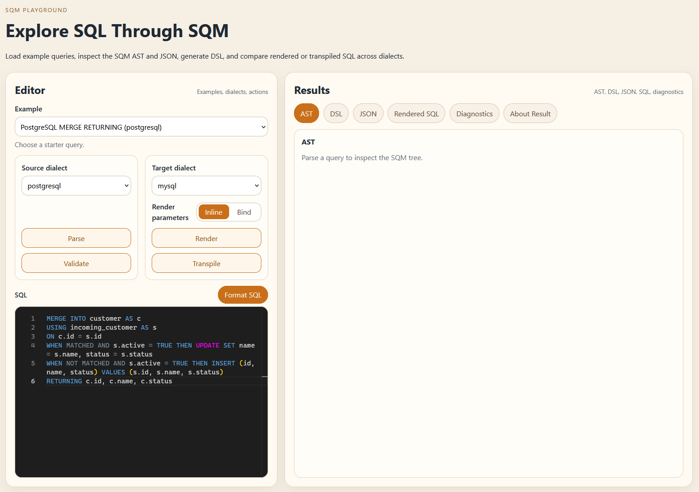
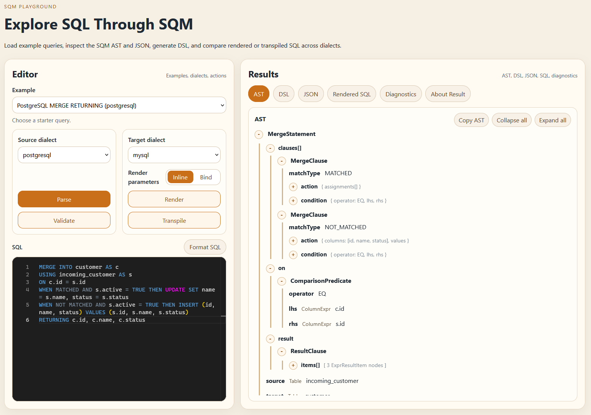
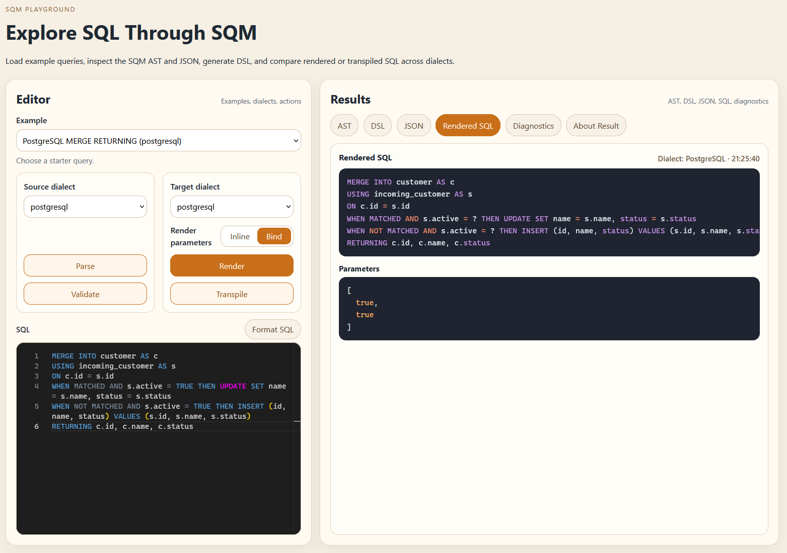
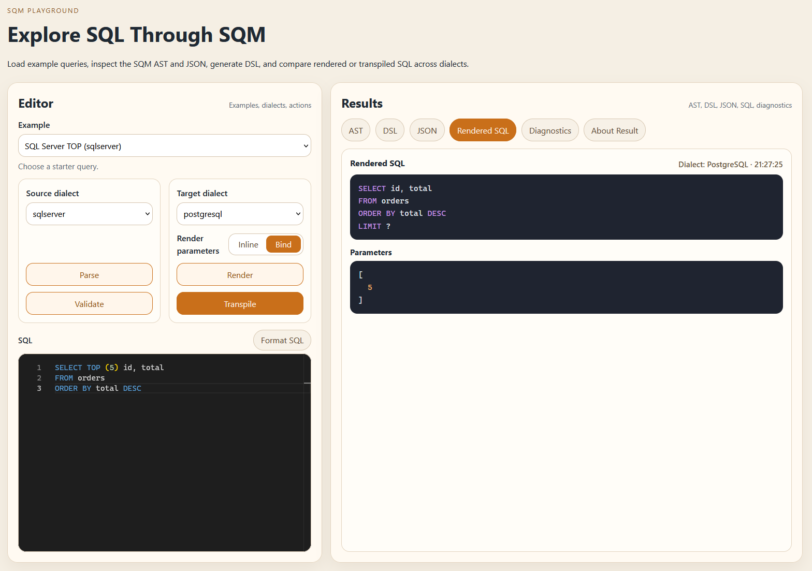

# SQM Playground

SQM Playground is a browser UI for trying SQM against real SQL text without
writing Java code. It combines the playground REST API and the React frontend in
one application so developers can inspect how SQL moves through the SQM parser,
renderer, validator, and transpiler.

Use it when you want to:

- try SQL examples across supported dialects
- parse SQL into the SQM model
- inspect the AST tree, SQM JSON, and generated DSL
- render SQL into a target dialect
- validate SQL and review diagnostics
- transpile SQL between dialects
- compare inline SQL rendering with bind-parameter rendering
- inspect multi-statement scripts as a combined result and per-statement views

DDL is out of scope for the playground unless the project adopts a separate DDL
design.

## What You Can Do

### Pick an Example or Write SQL

Choose one of the built-in examples, or edit the SQL directly. The source
dialect controls how the input is parsed. The target dialect controls render and
transpile output.



### Parse and Inspect the Model

The Parse action turns SQL into SQM model data. The results area can show:

- AST tree
- SQM JSON
- generated SQM DSL
- diagnostics when parsing fails

For multi-statement SQL, the response is a single `StatementSequence`. The UI
derives whole-script and per-statement AST/JSON/DSL views from that one payload.



### Render and Validate SQL

Render turns parsed SQM back into SQL for the selected target dialect. The
render parameter mode controls whether literal values stay inline or are emitted
as bind parameters.

Validate checks the SQM model with dialect-aware validation. For scripts,
diagnostics include the statement index so users can find which statement failed.



### Transpile Between Dialects

Transpile parses using the source dialect, applies SQM transpilation rules, and
renders the result using the target dialect. The output shows whether the
conversion was exact, approximate, or unsupported.

For multi-statement scripts, the playground shows one combined transpiled SQL
result. Partial output is not returned when one statement fails.



## Run with Docker

Run it locally:

```bash
docker run --rm -p 8080:8080 --name sqm-playground igorcher/sqm-playground:latest
```

Open:

```text
http://localhost:8080/
```

The backend API is served by the same container under:

```text
http://localhost:8080/sqm/playground/api/v1
```

Health check:

```text
http://localhost:8080/sqm/playground/api/v1/health
```

## Configure the API Base URL at Build Time

The default frontend API base URL is:

```text
/sqm/playground/api/v1
```

When the frontend and backend are served by the same container, the default is
usually correct. If the frontend should call a different backend URL, pass a
build argument:

```bash
docker build \
  -f deploy/docker/playground/Dockerfile \
  -t sqm-playground \
  --build-arg VITE_PLAYGROUND_API_BASE_URL=https://example.com/sqm/playground/api/v1 \
  .
```

## Useful Local Development Commands

Run backend tests:

```bash
mvn -pl sqm-playground-rest -am test
```

Run frontend tests and build:

```bash
cd sqm-playground-web
npm test
npm run build
```

Run the backend locally:

```bash
mvn -pl sqm-playground-rest -am spring-boot:run
```

Run the frontend locally:

```bash
cd sqm-playground-web
npm install
npm run dev
```

When running frontend and backend separately, make sure the frontend
`VITE_PLAYGROUND_API_BASE_URL` points to the backend playground API.
